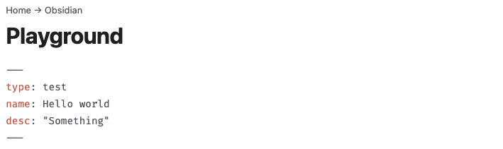

# Obsidian Backlinks Breadcrumbs

A simple and lightweight Obsidian plugin to display a breadcrumbs navigation from backlinks back to your Home/Index file.

The breadcrumbs are inserted on top of the page's content (above the inline title, if present). See screenshot below:

<picture>
  <source media="(prefers-color-scheme: dark)" srcset="./screenshot-dark.png">
  <source media="(prefers-color-scheme: light)" srcset="./screenshot-light.png">
  
</picture>

## Who is this plugin for ?

This plugin works well for vaults with a main Home or Index file from which all other files are linked hierarchically like branches in a tree.

It might not be great for you if you have usually many backlinks for each files in your vault (you might spend a lot of time manually setting the parent for each file).

## How does it work ?

This plugin will generate automatically the breadcrumbs from the first backlink in each file, until reaching the Home file or the maximum depth limit (5 by default).

If there is more than one backlink, a notice will appear telling you about the ambiguous ancestry of the file.

### Setting the parent file manually

When the ancestry is ambiguous (more than one backlink available), it might be useful to set the parent file manually. This is done using a `parent` metadata. Either from:
1. Dataview's inline field (Dataview plugin required) with `parent:: path-to-file`, or
2. from Front Matter metadata with `parent: path-to-file` in the YAML block.

The path must be a full path from the root of your vault to the target file, without the extension, like `Obsidian/Playground`.

### Note from the author

In my own vault, I have few files that require manually setting the parent. When the need arise, I prefer to set it discretely, using a Dataview inline field *at the end of the file*, after a horizontal bar.

Like this:

---
parent:: Obsidian/Playground

## Settings

There is a few settings you can change from Obsidian's Settings:

- *Homepage*: define your vault's Home or Index file
- *Separator*: change the separator glyph used between breadcrumbs
- *Maximum depth*: how many backlinks the plugin will go up trying to find your Home file
- *Show current file*: do you want the current file name to be displayed as the first breadcrumb ?
- *Show notice if ambiguous ancestry*: a toggle to show a notice in case of multiple backlinks and absence of parent metadata.

## Credits

- Cherry picked the `openOrSwitch` function from [Obsidian-community-lib](https://github.com/obsidian-community/obsidian-community-lib)

## Support

This plugin is provided for free. If you found this plugin useful and want to support my work I'll gladly accept a small donation.

